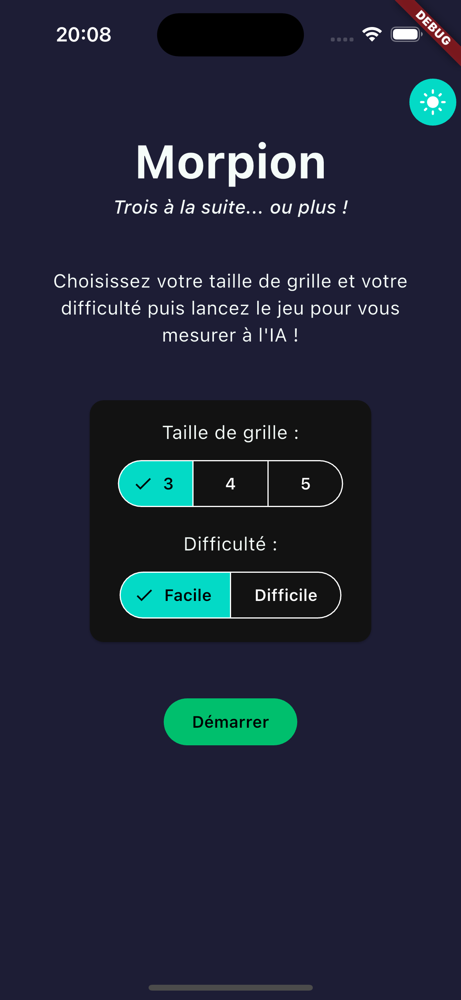
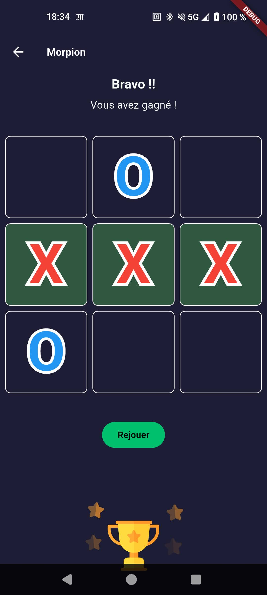

# Tic-Tac-Toe

A modern Tic-Tac-Toe application built with Flutter, featuring an AI opponent with various difficulty levels.

## Getting Started

This project uses standard Flutter tooling. No code generation steps are required to run the app in debug mode.

To run the application:

```bash
flutter run
```

## Features & Architecture

This application features a clean architecture-like approach separating domain logic from UI components.

*   **State Management**: Uses **Riverpod** to manage game state and separate it from the UI.
*   **AI Opponent**: Implements the **Minimax algorithm** (with Negamax variant) for the computer player, ensuring a challenging opponent.
*   **Dynamic Grid Sizes**: Supports 3x3, 4x4, and 5x5 grids.
*   **Theming**: Light/Dark mode support.
*   **Localization**: English and French support.
*   **Testing**: Unit tests for core domain logic (`Board` and AI bots) and state management (`GameProvider`).

### Screenshots

Start screen with settings: 



Game screen: 



## Possible Improvements

### Platform support

- Add web support with support for various layout shapes & sizes 

### Game Logic & UX

- Implement a human vs human game mode.
- Add an Undo/Redo functionnality.
- Add an animation over winning line (e.g. strikethrough effect).
- Add some sound effects & haptics, e.g. subtle sounds for placing a mark, winning, or losing, along with haptic feedback (vibration) on mobile, to make the game "feel" more physical. 
- Stop the game as soon as no player can win (early draw detection), which would be particularly useful for 4x4 and 5x5 grids.
- Add visual loading states and better error handling in the UI (currently `TODO` in `game_provider.dart`).

### Code Quality & Architecture

- **Code Generation**: Reduce boilerplate by introducing:
  - `freezed` for immutable data classes (`Board`, `GameResult`). Useful to avoid boilerplate equals / hashscode / copyWith.
  - `json_serializable` (through `freezed`) for serialization/deserialization
  - `get_it` + `injectable` for Dependency Injection (to decouple `StatsDatasource`, `SettingsDatasource` and others).
  - `flutter_gen_runner` to replace String-based APIs for assets by static access APIs 
- **Refactoring**:
  - Optimize the `winner` detection method in `Board` (e.g. merge row/column checks).
  - Improve `GameProvider` tests to be time-independent.
  - Move AI computation to isolate
  - Add an iterative deepening based on time so the algorithm stops looking for the best move after a given time (e.g. 1 second). That would guarantee that the AI always returns a move quickly, even on slower devices.
  - Make sure Riverpod usage is correct. Not sure about providers inter-dependency, I'll have to check
- **Static Analysis**: Integrate stricter linting rules (e.g., `very_good_analysis` or DCM).
- **Tests & CI/CD**: 
  - We could add golden tests & integration tests to ensure that our app works end-to-end and is pixel-perfect. 
  - Also add unit tests for providers that are not currently tested (theme & stats providers). 
